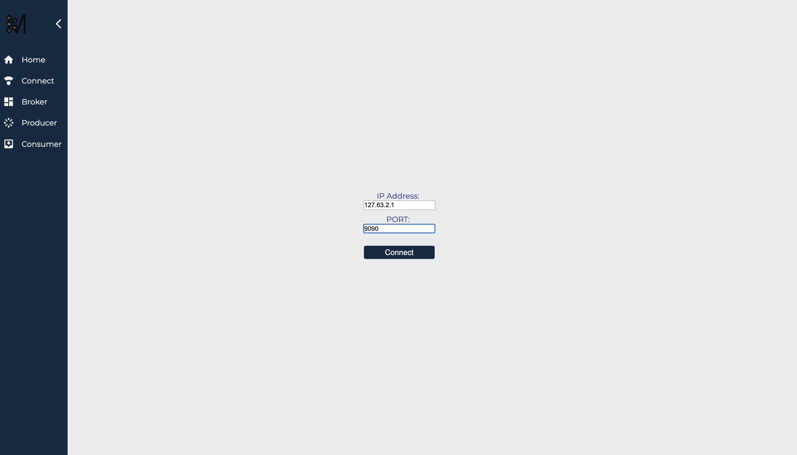
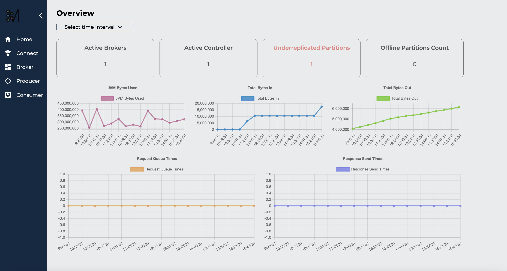

  <a href="http://metamorphosis.app/">
 

# Metamorphosis
Monitor and visualize your Kafka clusters with Metamorphosis

  
  
  
  
    

‌

## Table of Contents

[Overview](#overview)  
[Quick Start](#quick-start)  
[Viewing your metrics](#viewing-your-metrics)  
[Engineers](#authors)

## Overview
Monitor and visualize your Kafka clusters with Metamorphosis:
Metamorphosis is a monitoring and visualization tool for your Kafka cluster that allows developers to quickly determine whether new services are functioning correctly. It provides a set of dashboards to inspect each component in the cluster. The tool can be deployed on-premise, so you don't have to rely on expensive cloud solutions.

## Quick Start

Metamorphosis is incredibly easy to incorporate into your application. Let's walk through the steps you'll need to take.

1. Clone this repo (https://github.com/oslabs-beta/Metamorphosis.git)
2. Cd into Metamorphosis
3. Start the application with npm start
4. Navigate to localhost:8080
5. Within the GUI, navigate to the setting page and enter the location (e.g. port 9092) of your Prometheus Instance

## Viewing your metrics

To view your metrics, you will need to use the Metamorphosis app built in this repo or access our website directly. Follow these instructions.

1. Sign into your account here (metamorphosis-phi.vercel.app).
2. Connect your Prometheus instance by providing its IP address and PORT. This allows Metamorphosis to access the exposed Kafka metrics and send them to our UI.

You're all set! You should be able to track analytics as data moves through your Kafka application, and make vital decisions about your system.

# See Metamorphosis in action using our Kafka monitor and visualizer
Connect your Prometheus instance:

You can access your metrics through our dashboards:

## Authors
Metamorphosis Engineers

[Josephine Chen](https://github.com/ChenJosephine)  
[Chris Inoue](https://github.com/Chrisxesq)   
[Tristyn Ruiz](https://github.com/Tristyn-Ruiz)  
[Alessandro Battellino](https://github.com/AlessBattellino)  
[Adam Rodriguez](https://github.com/AdamXRodriguez)  

We welcome contributions, so please feel free to fork, clone, and help Metamorphosis grow! Remember to leave a  if you'd like to support our work!

So go:
    Add a GitHub Star to the project.
    Write a review or tutorial on Medium, Dev.to or personal blog.
    Contribute to this project by raising a new issue or making a PR to solve an issue.

## License
Released under the MIT License

Disclaimer: Apache Kafka is a registered trademark of the ASF and that `Metamorphosis` is an independent product and not endorsed by the ASF.
