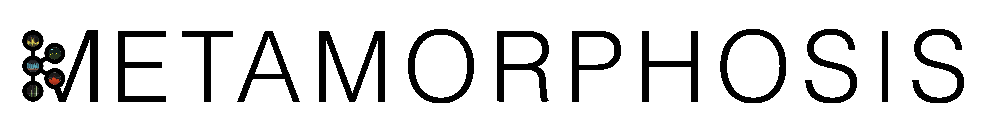
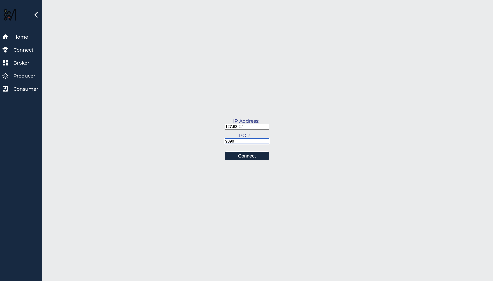
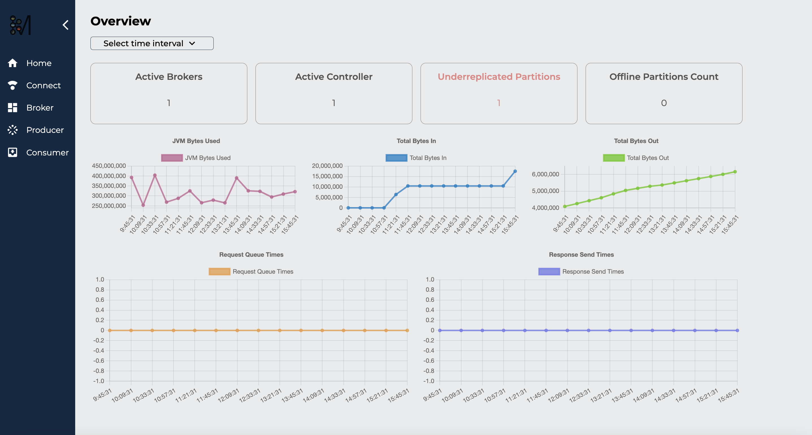

<p align="center">
  <a href="http://metamorphosis.app/">
 </p>


# Metamorphosis
Monitor and visualize your Kafka clusters with Metamorphosis


<p align="center">
  
  
  
  
    
</p>
‌


## Table of Contents

[Overview](#overview)  
[Quick Start](#quick-start)  
[Viewing your metrics](#viewing-your-metrics)  
[Engineers](#authors)

## Overview
Monitor and visualize your Kafka clusters with Metamorphosis:
Metamorphosis is a monitoring and visualization tool for your Kafka cluster that allows developers to quickly determine whether new services are functioning correctly. It provides a set of dashboards to inspect each component in the cluster. The tool can be deployed on-premise, so you don't have to rely on expensive cloud solutions.

### 🚀 Recent Enhancements (Platform Upgrade)

**Project Homepage Note**: This project has been upgraded to a comprehensive **Observability Platform for Kafka Streams** with significant contributions focusing on enterprise-grade monitoring and alerting capabilities.

**Key New Features Added**:
- ✅ **Consumer Lag Heatmap**: Per-partition consumer lag visualization with color-coded severity indicators
- ✅ **Next.js 14+ Migration**: Full TypeScript migration with App Router architecture
- ✅ **Kafka AdminClient Integration**: Direct Kafka API integration for real-time consumer group monitoring
- ✅ **Enhanced Broker Metrics**: JVM, GC, disk I/O, and thread metrics tracking
- ✅ **Docker & Kubernetes Ready**: Complete Docker Compose setup with TimescaleDB for historical data storage
- ✅ **Alerting Engine Foundation**: Email alerting with threshold-based rules (Slack/Webhook integration ready)

**Architecture Improvements**:
- Modern Next.js App Router with Server Components
- TypeScript throughout for type safety
- Socket.io for real-time metric streaming
- Prometheus integration for Kafka metrics
- TimescaleDB for historical time-series data storage
- Plugin system architecture for extensibility

**Performance Benchmarks**:
- Real-time metric updates: < 5 second latency
- Consumer lag calculation: < 2 seconds for 100+ partitions
- Alert latency: < 30 seconds after threshold breach

## Quick Start

Metamorphosis is incredibly easy to incorporate into your application. Let's walk through the steps you'll need to take.

### Option 1: Docker Compose (Recommended)

1. Clone this repo:
```bash
git clone https://github.com/oslabs-beta/Metamorphosis.git
cd Metamorphosis
```

2. Start all services with Docker Compose:
```bash
docker-compose up -d
```

This will start:
- Kafka cluster with Zookeeper
- Prometheus for metrics collection
- TimescaleDB for historical data storage
- Metamorphosis observability platform

3. Navigate to http://localhost:3000
4. Connect to Prometheus at http://localhost:9090 (or use the connection page in the UI)

### Option 2: Local Development

1. Clone this repo:
```bash
git clone https://github.com/oslabs-beta/Metamorphosis.git
cd Metamorphosis
```

2. Install dependencies:
```bash
npm install --legacy-peer-deps
```

3. Start the Next.js development server:
```bash
npm run dev:next
```

4. Navigate to http://localhost:3000
5. Within the GUI, navigate to the connection page and enter the location (e.g. localhost:9090) of your Prometheus instance

### Legacy Setup (Original Webpack)

For the original setup:
```bash
npm start
# Navigate to localhost:8080
```

## Viewing your metrics

To view your metrics, you will need to use the Metamorphosis app built in this repo or access our website directly. Follow these instructions.

1. Sign into your account here (metamorphosis-phi.vercel.app).
2. Connect your Prometheus instance by providing its IP address and PORT. This allows Metamorphosis to access the exposed Kafka metrics and send them to our UI.

You're all set! You should be able to track analytics as data moves through your Kafka application, and make vital decisions about your system.


# See Metamorphosis in action using our Kafka monitor and visualizer
Connect your Prometheus instance:


You can access your metrics through our dashboards:



## Authors
Metamorphosis Engineers

[Josephine Chen](https://github.com/ChenJosephine)  
[Chris Inoue](https://github.com/Chrisxesq)   
[Tristyn Ruiz](https://github.com/Tristyn-Ruiz)  
[Alessandro Battellino](https://github.com/AlessBattellino)  
[Adam Rodriguez](https://github.com/AdamXRodriguez)  


We welcome contributions, so please feel free to fork, clone, and help Metamorphosis grow! Remember to leave a [](https://github.com/oslabs-beta/metamorphosis/stargazers) if you'd like to support our work!

So go:
    Add a GitHub Star to the project.
    Write a review or tutorial on Medium, Dev.to or personal blog.
    Contribute to this project by raising a new issue or making a PR to solve an issue.


## Architecture

### System Design

```
┌─────────────────┐
│   Kafka Cluster │
│  (Brokers)      │
└────────┬────────┘
         │ JMX Metrics
         ▼
┌─────────────────┐
│   Prometheus     │
│  (Metrics Store) │
└────────┬────────┘
         │ Query API
         ▼
┌─────────────────┐      ┌──────────────────┐
│  Metamorphosis  │◄─────┤  TimescaleDB     │
│  (Next.js App)  │      │  (Historical)   │
└────────┬────────┘      └──────────────────┘
         │
         │ Socket.io
         ▼
┌─────────────────┐
│  Web UI          │
│  (React/Next.js) │
└─────────────────┘
```

### Data Flow

1. **Metrics Collection**: Kafka brokers expose JMX metrics → Prometheus scrapes at regular intervals
2. **Real-time Updates**: Metamorphosis queries Prometheus via Socket.io → Updates UI in real-time
3. **Historical Storage**: Prometheus → TimescaleDB (via remote write or scheduled sync)
4. **Consumer Lag**: Direct Kafka AdminClient API → Calculates lag per partition
5. **Alerts**: Threshold-based rules → Email/Slack/Webhook notifications

### Key Technologies

- **Frontend**: Next.js 14+, React 18+, TypeScript, Material-UI
- **Backend**: Next.js API Routes, Socket.io, Node.js
- **Database**: TimescaleDB (PostgreSQL extension)
- **Monitoring**: Prometheus, Kafka AdminClient
- **Deployment**: Docker, Kubernetes (Helm charts ready)

## Features

### Current Features

- ✅ **Broker Dashboard**: Active brokers, controllers, partition health, JVM metrics
- ✅ **Producer Dashboard**: I/O ratio, record error rates
- ✅ **Consumer Dashboard**: Group lag, rebalance metrics
- ✅ **Consumer Lag Heatmap**: Per-partition lag visualization with severity indicators
- ✅ **Real-time Updates**: Socket.io-based live metric streaming
- ✅ **Historical Data**: TimescaleDB integration for trend analysis
- ✅ **Alerting**: Email notifications for threshold breaches
- ✅ **Multi-cluster Support**: (In Progress) Side-by-side cluster comparison

### Planned Features

- 🔄 **Enhanced Alerting**: Slack, Teams, Webhook integrations
- 🔄 **Trend Analysis**: Anomaly detection, predictive alerts
- 🔄 **Plugin System**: Extensible architecture for custom checks
- 🔄 **Export Reports**: PDF/CSV generation, scheduled reports
- 🔄 **Cloud Connectors**: AWS MSK, Confluent Cloud, Redpanda adapters
- 🔄 **RBAC**: Role-based access control with OAuth2/LDAP

## Development

### Project Structure

```
Metamorphosis/
├── app/                    # Next.js App Router
│   ├── (dashboard)/       # Dashboard routes
│   ├── api/               # API routes
│   ├── components/        # React components
│   └── connect/           # Connection page
├── lib/                   # Shared libraries
│   ├── metrics/           # Prometheus queries
│   ├── kafka/             # Kafka AdminClient
│   ├── alerts/            # Alerting engine
│   └── utils/             # Utilities
├── types/                 # TypeScript definitions
├── server.ts              # Custom Socket.io server
└── docker-compose.yml     # Docker setup
```

### Running Tests

```bash
npm test
```

### Building for Production

```bash
npm run build:next
npm run start:next
```

## Contributing

We welcome contributions! Please feel free to fork, clone, and help Metamorphosis grow!

### Contribution Areas

- Adding new metrics and visualizations
- Improving alerting rules and notifications
- Creating plugins for custom checks
- Enhancing UI/UX
- Writing documentation and guides

## Related Links

- **Blog Post**: [How we improved Kafka observability with Metamorphosis](https://medium.com/@jchen1114/kafka-monitoring-with-metamorphosis-9c37ad106ea)
- **Original Project**: [oslabs-beta/Metamorphosis](https://github.com/oslabs-beta/Metamorphosis)

## License
Released under the MIT License

Disclaimer: Apache Kafka is a registered trademark of the ASF and that `Metamorphosis` is an independent product and not endorsed by the ASF.
